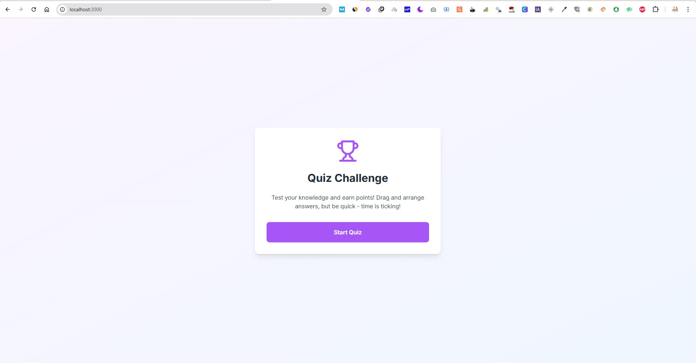
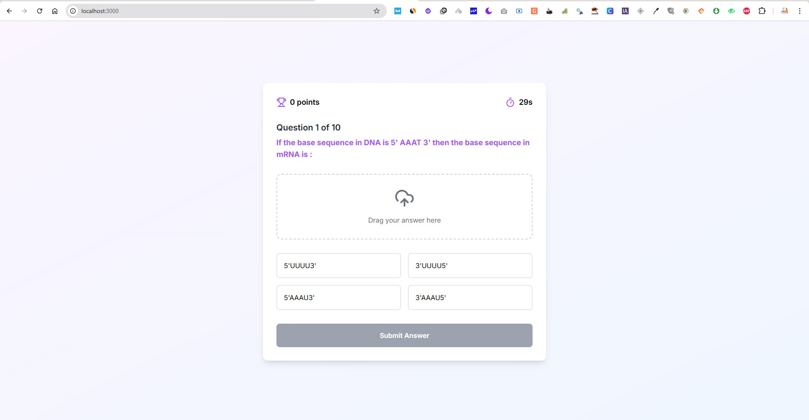
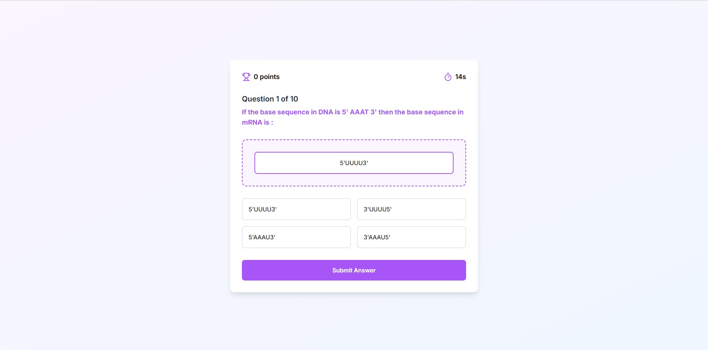
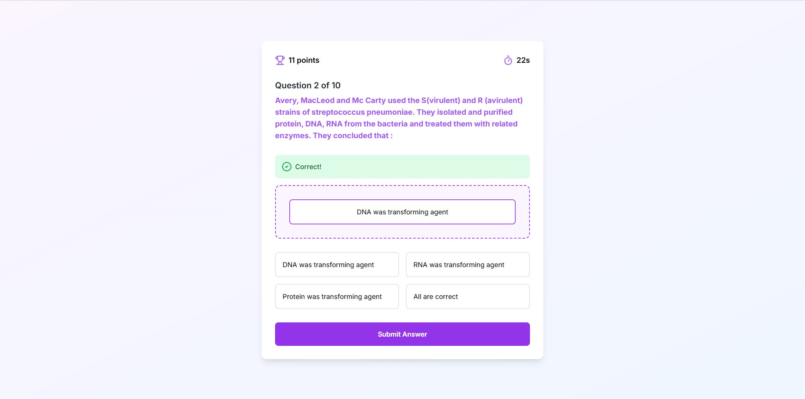
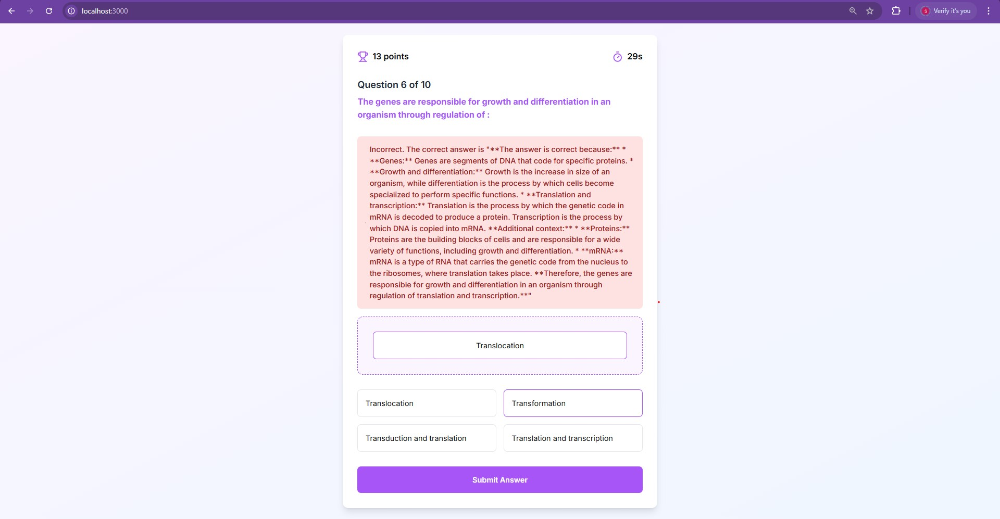
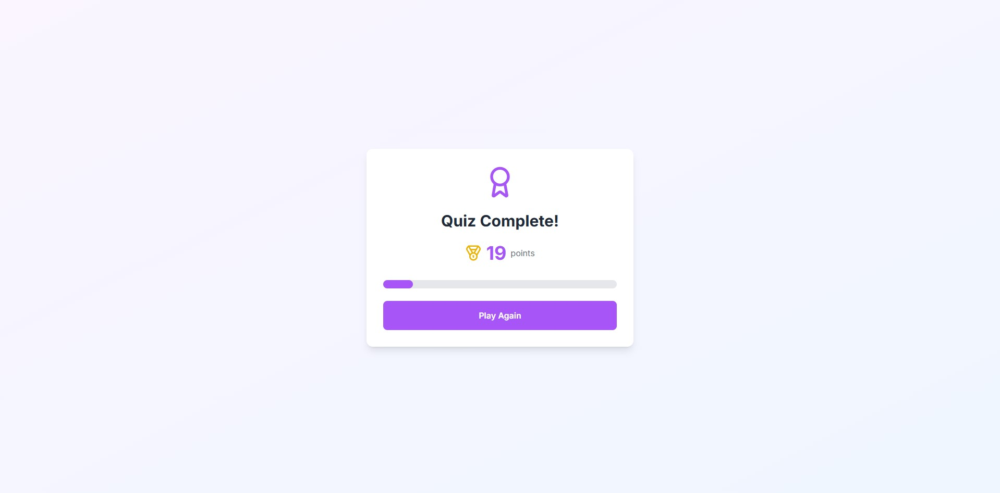

# Quiz Challenge Application

A modern, interactive quiz application built with Next.js featuring drag-and-drop functionality and gamification elements.

# Screenshots







## Features

- Interactive quiz interface with drag-and-drop answer arrangement
- Real-time scoring system
- Timer-based questions
- Gamification elements (points, progress tracking)
- Responsive design
- Beautiful animations and transitions
- Error handling and loading states

## Technologies Used

- Next.js
- React
- Tailwind CSS
- @hello-pangea/dnd (for drag and drop functionality)
- Framer Motion (for animations)
- Lucide React (for icons)

## Getting Started

1. Clone the repository
2. Install dependencies:
   ```bash
   npm install
   ```
3. Run the development server:
   ```bash
   npm run dev
   ```
4. Open [http://localhost:3000](http://localhost:3000) in your browser

## How to Play

1. Click "Start Quiz" to begin
2. Drag and arrange the answers in your preferred order
3. The top answer will be submitted when you click "Next Question"
4. You have 30 seconds per question
5. Points are awarded based on correct answers and remaining time
6. Complete all questions to see your final score

## Scoring System

- Base points for correct answers
- Bonus points based on remaining time
- Maximum possible score varies based on speed and accuracy

## Project Structure

- `app/page.js`: Main quiz application component
- `app/globals.css`: Global styles
- `public/`: Static assets

## Features Implemented

1. Data Integration
   - Fetches quiz data from the provided API endpoint
   - Implements error handling and loading states

2. Core Features
   - Start quiz functionality
   - Multiple-choice questions with drag-and-drop answers
   - Clean, modern, and minimal design
   - Comprehensive results summary

3. Gamification Elements
   - Points system
   - Timer
   - Progress tracking
   - Visual feedback
   - Animations and transitions

4. User Experience
   - Responsive design
   - Intuitive interface
   - Clear feedback
   - Smooth animations

## License

MIT